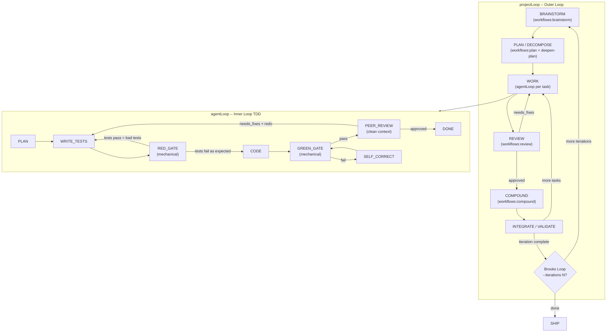

# PI Agent Loop Implementation Plan

## Context

Three sources converge into one system:

- **PRD v2** -- Defines the TDD state machine, mechanical gates, Brooks Loop, progressive disclosure, and git-bound state.
- **OpenAI Harness Engineering** -- Repository knowledge as system of record, AGENTS.md as table of contents, mechanical enforcement of architecture, agent legibility.
- **Compound Engineering** -- The Plan/Work/Review/Compound loop, 29 specialized agents, 19 skills, swarm orchestration patterns, and the `/lfg` pipeline.

PI's job is to be the autonomous orchestrator that runs these workflows programmatically -- no human in the loop -- using the Compound Engineering prompts in their pure form and spawning sub-agents when appropriate.

## Existing Codebase

All files are deleted from the working directory but exist in git history. The monorepo has 7 packages:

- `packages/ai` -- Mature multi-provider LLM abstraction (20+ providers, streaming, tools)
- `packages/agent` -- Basic agent loop with tool execution, rudimentary `ExecutionEngine` + `Reviewer` (partially implemented)
- `packages/coding-agent` -- CLI coding agent with file tools (bash, read, write, edit)
- `packages/tui`, `packages/web-ui`, `packages/mom`, `packages/pods` -- supporting packages

A [transformation plan](2026-02-15-feat-harness-engineering-transformation-plan.md) already exists covering mechanical enforcement fixes (biome `noExplicitAny`, commit linting, architecture checks). That plan's Phases 1-2 should be executed first as a prerequisite.

---

## Architecture

### How PI Maps to Compound Engineering Stages



### Skill and Agent Registry

PI embeds the full Compound Engineering prompt library as a registry. During each phase, PI's orchestrator selects and spawns the appropriate agents:

**BRAINSTORM phase** invokes:

- `brainstorming` skill (pure form)
- `repo-research-analyst` agent
- `learnings-researcher` agent (queries `docs/solutions/`)

**PLAN phase** invokes:

- `workflows:plan` prompt (pure form)
- `best-practices-researcher` agent (conditional, for unfamiliar territory)
- `framework-docs-researcher` agent (conditional)
- `spec-flow-analyzer` agent
- `deepen-plan` command (spawns 5+ parallel research sub-agents)

**WORK phase** (per-task `agentLoop`) invokes:

- `git-worktree` skill (isolation)
- The TDD state machine (PI-specific, not from CE)
- `agent-browser` skill (if UI work detected)
- `figma-design-sync` agent (if design specs present)

**REVIEW phase** invokes up to 14+ agents in parallel (pure CE prompts):

- `security-sentinel`, `performance-oracle`, `architecture-strategist`
- `kieran-typescript-reviewer`, `pattern-recognition-specialist`
- `code-simplicity-reviewer`, `agent-native-reviewer`
- `data-integrity-guardian` (conditional: DB changes)
- `data-migration-expert`, `deployment-verification-agent` (conditional: migrations)
- Additional agents based on project type

**COMPOUND phase** invokes:

- `compound-docs` skill (pure form, with 6 parallel sub-agents)
- `learnings-researcher` (cross-reference existing solutions)

**Sub-agent spawning:** PI can spawn any agent either as a direct `Task()` sub-agent (short-lived, returns result) or as a `Teammate` in a swarm team (persistent, inbox-based communication), using the `orchestrating-swarms` skill patterns. This allows PI to run an entire review swarm or research swarm in parallel.

---

## Phase 0: Restore, Stabilize, and Install Compound Engineering

- Run `git checkout .` to restore all deleted files
- Run `npm install` to restore dependencies
- Execute the existing transformation plan Phases 1-2 (mechanical enforcement: fix `--write` race condition, enable `noExplicitAny: "error"`, add commit linting, add architecture checks)
- Verify `npm run check` passes
- **Install Compound Engineering for Pi** using the official plugin CLI:
  ```bash
  bunx @every-env/compound-plugin install compound-engineering --to pi
  ```
  This writes all 29 agents, 19 skills, 5 workflow commands, and MCPorter config to `~/.pi/agent/` with the correct directory structure:
  - `~/.pi/agent/prompts/` -- Workflow command prompts
  - `~/.pi/agent/skills/` -- All skill SKILL.md files with references
  - `~/.pi/agent/extensions/` -- Agent definitions
  - `~/.pi/agent/compound-engineering/mcporter.json` -- MCPorter interoperability
- Also sync personal config if applicable:
  ```bash
  bunx @every-env/compound-plugin sync --target pi
  ```
  This symlinks personal skills from `~/.claude/skills/` and MCP servers so they are available to PI.

**Key files:** `package.json`, `biome.json`, `.husky/pre-commit`, `.husky/commit-msg`, `scripts/check-architecture.ts`, `~/.pi/agent/`

---

## Phase 1: Skill and Agent Registry

Create a registry in `packages/agent` that discovers and loads all Compound Engineering prompts from the installed Pi plugin directory (`~/.pi/agent/`), making them invocable programmatically.

**New file:** `packages/agent/src/skill-registry.ts`

- Define a `SkillDefinition` type: `{ name, category, prompt, description, skillPath, references?, applicabilityCheck? }`
- Define an `AgentDefinition` type: `{ name, category, systemPrompt, tools?, model? }`
- Define a `WorkflowDefinition` type: `{ name, prompt, phases }`
- **Discovery:** Scan `~/.pi/agent/` at startup to load all installed CE assets:
  - Read `~/.pi/agent/extensions/` for agent definitions (29 agents)
  - Read `~/.pi/agent/skills/` for skill SKILL.md files (19 skills, with references subdirs)
  - Read `~/.pi/agent/prompts/` for workflow command prompts (5 workflows + utility commands)
  - Parse markdown frontmatter to extract name, description, category
- Export `AGENTS`, `SKILLS`, `WORKFLOWS` maps populated from discovered files
- Provide `selectAgents(phase, context)` function that returns the right agents for a given phase based on context (e.g., file types changed, whether DB migrations exist, project language)
- Provide `getAgentPrompt(name)`, `getSkillPrompt(name)`, `getWorkflowPrompt(name)` for direct lookup
- Support hot-reload: re-scan directory if files change (skills are symlinked, so CE plugin updates flow through automatically)

**New file:** `packages/agent/src/sub-agent.ts`

- `spawnSubAgent(agentDef, prompt, options)` -- wraps the existing `agentLoop()` to run an agent with a specific system prompt and isolated context
- `spawnParallelAgents(agentDefs[], prompts[])` -- runs multiple agents concurrently, collects results
- `spawnSwarm(teamName, agentDefs[], taskDefs[])` -- creates a full swarm team using the `orchestrating-swarms` skill patterns (TeammateTool operations, task dependencies, inbox communication)
- Supports both "inline" mode (same process, awaited) and "background" mode (fire-and-forget with result collection)
- Can also spawn a sub-agent to run an arbitrary script (e.g., `npx tsx some-script.ts`) for cases where a dedicated process is more appropriate than an LLM call

---

## Phase 2: Mechanical Gates

**New file:** `packages/agent/src/gates.ts`

Implement all 5 deterministic gates from the PRD:

- `validateDecomposition(tasks)` -- Verify plan is parseable, all tasks have acceptance criteria. Returns pass/fail.
- `redTestGate(cwd)` -- Run `pnpm test`. Must FAIL. Returns pass if tests fail (proving tests target unimplemented code).
- `greenGate(cwd)` -- Run `pnpm run validate` (tests + lint + arch check). Must PASS. Returns pass if exit code 0.
- `validateArchitecture(cwd)` -- Run `dependency-cruiser` against `ARCHITECTURE.md` boundaries. Returns pass/fail.
- `validateReview(reviewOutput)` -- Parse review output, must map to exactly `approved` / `needs_fixes` / `rejected`.

Each gate is a pure function that runs a real command and returns a structured `GateResult: { passed, output, diagnostics? }`. No LLM can override a failing gate.

**Modified file:** `packages/agent/src/index.ts` -- export gates

---

## Phase 3: TDD State Machine (Inner Loop -- "Work")

**New file:** `packages/agent/src/tdd-loop.ts`

The TDD state machine wraps the existing `agentLoop()` for LLM calls and adds mechanical gates between phases:

```
PLAN -> WRITE_TESTS -> RED_GATE -> CODE -> GREEN_GATE -> PEER_REVIEW -> DONE
                                            |                |
                                       PARSE_ERROR      needs_fixes
                                            |                |
                                       SELF_CORRECT    THROW_AWAY_REDO
```

- **State type:** `TddState = 'plan' | 'write_tests' | 'red_gate' | 'code' | 'green_gate' | 'parse_error' | 'self_correct' | 'peer_review' | 'done' | 'fail'`
- Each LLM state (plan, write_tests, code, self_correct) calls `agentLoop()` with a phase-specific system prompt
- Each gate state (red_gate, green_gate) calls the corresponding function from `gates.ts`
- **WRITE_TESTS** uses a dedicated prompt that writes tests based ONLY on acceptance criteria (the "homework problem" prevention)
- **PEER_REVIEW** spawns a review sub-agent with CLEAN CONTEXT (task + plan + diff + learnings only -- no coding conversation)
- **SELF_CORRECT** parses test/lint output into structured diagnostics, then calls `agentLoop()` with error context
- **THROW_AWAY_REDO:** If peer review says `needs_fixes` and redo attempts remain, run `git checkout .`, log learnings, and re-enter the TDD loop with learnings injected
- Max retries configurable via `PI_MAX_REDO_ROUNDS` (default: 1)
- Emits `TddLoopEvent` objects for every state transition (for dashboard, Section 13)

**New file:** `packages/agent/src/tdd-prompts.ts`

- System prompts for each TDD phase (plan, write_tests, code, self_correct)
- The WRITE_TESTS prompt explicitly instructs: "Write tests based ONLY on the acceptance criteria. Do NOT look at any implementation code."
- The PEER_REVIEW prompt uses the existing `reviewer.ts` prompt enhanced with three-outcome parsing (approved/needs_fixes/rejected)

---

## Phase 4: Project Loop (Outer Loop -- Full Pipeline)

**New file:** `packages/agent/src/project-loop.ts`

Orchestrates the full Compound Engineering pipeline for a high-level goal:

### BRAINSTORM phase

- Loads the `brainstorming` skill prompt (pure form)
- Spawns `repo-research-analyst` and `learnings-researcher` as parallel sub-agents
- LLM explores problem space, proposes 2-3 approaches, applies YAGNI
- Output: `ARCHITECTURE.md` boundaries, recommended approach

### PLAN / DECOMPOSE phase

- Loads the `workflows:plan` prompt (pure form)
- Spawns `spec-flow-analyzer` to validate flows
- Conditionally spawns `best-practices-researcher` and `framework-docs-researcher`
- Decomposes goal into max 20 tasks, each with explicit acceptance criteria
- Runs `validateDecomposition()` gate
- Output: `EXECUTION_PLAN.md`, `PROJECT_STATUS.md`

### WORK phase (per task)

- For each task, runs `tddLoop(task)` from Phase 3
- After each task, routing decision:
  - `approved` -> git commit + compound/learn + next task
  - `needs_fixes` + redo available -> `git checkout .` + redo with learnings
  - `needs_fixes` + no redo -> self-correct patch
  - `rejected` -> fail task, attempt recovery

### REVIEW phase (per task)

- After each task's TDD loop completes with `approved`, run the full CE review
- Spawns 14+ review agents in parallel using the pure CE prompts from the registry
- Uses `spawnParallelAgents()` from sub-agent module
- Synthesizes findings into P1/P2/P3 categories
- P1 findings trigger throwaway-and-redo

### COMPOUND phase (every 5 tasks)

- Loads `compound-docs` skill (pure form) with its 6 parallel sub-agents
- Runs `COMPACT_LEARNINGS` prompt to deduplicate and index knowledge
- Updates `LEARNINGS.md`
- Provides `query_learnings(topic)` tool to future agent calls

### INTEGRATE and VALIDATE phase

- Full workspace validation: `pnpm run validate`
- Final holistic LLM review of entire project
- Spawns `architecture-strategist` and `code-simplicity-reviewer` for final pass

### Brooks Loop

- Config: `--iterations N` (default 1, "build twice" mode = 2)
- After iteration 1: write `ITERATION_1_LEARNINGS.md`, `git tag iteration-1-complete`, `git checkout .`
- Iteration 2: fresh BRAINSTORM and DECOMPOSE armed with iteration 1 learnings
- Ship iteration 2

**New file:** `packages/agent/src/project-events.ts`

- `ProjectLoopEvent` types for every state transition
- NDJSON writer to `events.jsonl`

---

## Phase 5: Memory and Progressive Disclosure ("Compound")

**New file:** `packages/agent/src/memory.ts`

- `compactLearnings(learningsPath)` -- LLM-powered compaction that deduplicates and indexes knowledge from `LEARNINGS.md`
- `queryLearnings(topic, learningsPath)` -- Searches indexed learnings by topic, returns relevant snippets (not the entire file)
- `addLearning(entry, learningsPath)` -- Appends a structured learning entry
- Runs every 5 tasks as part of the COMPOUND phase
- Uses the `compound-docs` skill's YAML schema for categorization
- Stores in `docs/solutions/` using the CE category structure (build-errors/, performance-issues/, etc.)

**New file:** `packages/agent/src/state-files.ts`

- Git-bound state file management:
  - `PROJECT_STATUS.md` -- Live execution plan with checkmarks and attempt trackers
  - `LEARNINGS.md` -- Accumulated institutional knowledge
  - `ITERATION_N_LEARNINGS.md` -- Per-iteration summaries
  - `ARCHITECTURE.md` -- Hard architectural boundaries
  - `EXECUTION_PLAN.md` -- The deterministic plan
- Functions: `updateProjectStatus()`, `commitState()`, `readState()`
- Git operations: commit after each task, `git checkout .` before redo, tag before iteration switch

---

## Phase 6: CLI Runners

**New file:** `packages/agent/src/runner.ts`

Single task runner:

```bash
npx tsx packages/agent/src/runner.ts "Add a hello() function..."
```

- Parses task description from CLI args
- Runs `tddLoop(task)` directly
- Environment: `MINIMAX_API_KEY`, `PI_TEST_COMMAND`, `PI_MAX_REDO_ROUNDS`

**New file:** `packages/agent/src/project-runner.ts`

Project runner with Brooks Loop:

```bash
npx tsx packages/agent/src/project-runner.ts --iterations 2 "Build a REST API"
```

- Parses goal and options from CLI args
- Runs `projectLoop(goal, options)`
- Supports: `--iterations N`, `--max-tasks N`, `--provider <name>`
- Provider-agnostic: defaults to MiniMax M2.5 Lightning but accepts any provider the `@pi/ai` layer supports

---

## Phase 7: Knowledge Infrastructure (Harness Engineering)

Following OpenAI's approach, restructure the repo's knowledge base:

- Slim `AGENTS.md` to ~100 lines (table of contents, not encyclopedia)
- Structure `docs/` directory as the system of record:
  - `docs/plans/` -- Active and completed plans
  - `docs/solutions/` -- Compound Engineering knowledge base (categorized)
  - `docs/brainstorms/` -- Brainstorm outputs
  - `docs/references/` -- External docs, llms.txt files
- `ARCHITECTURE.md` at root -- Hard boundaries for `dependency-cruiser`
- `CLAUDE.md` -- Agent operating instructions (progressive disclosure pointers)
- Ensure all knowledge is repo-local and versioned (nothing in Slack/Docs/heads)

---

## File Summary

| File | Action | Purpose |
|------|--------|---------|
| `packages/agent/src/skill-registry.ts` | Create | All 29 agents + 19 skills + 5 workflows as invocable prompts |
| `packages/agent/src/sub-agent.ts` | Create | Sub-agent spawning (parallel, sequential, swarm) |
| `packages/agent/src/gates.ts` | Create | 5 mechanical gates (red, green, arch, decomp, review) |
| `packages/agent/src/tdd-loop.ts` | Create | Inner loop TDD state machine |
| `packages/agent/src/tdd-prompts.ts` | Create | Phase-specific system prompts for TDD |
| `packages/agent/src/project-loop.ts` | Create | Outer loop orchestrator (full CE pipeline) |
| `packages/agent/src/project-events.ts` | Create | Event types + NDJSON writer |
| `packages/agent/src/memory.ts` | Create | Progressive disclosure + learnings compaction |
| `packages/agent/src/state-files.ts` | Create | Git-bound state file management |
| `packages/agent/src/runner.ts` | Create | Single-task CLI runner |
| `packages/agent/src/project-runner.ts` | Create | Project CLI runner with Brooks Loop |
| `packages/agent/src/reviewer.ts` | Modify | Three-outcome parsing (approved/needs_fixes/rejected) |
| `packages/agent/src/index.ts` | Modify | Export all new modules |
| `ARCHITECTURE.md` | Create | Hard architectural boundaries |
| `AGENTS.md` | Modify | Slim to ~100 lines, table of contents |
| `scripts/check-architecture.ts` | Modify | Add dependency-cruiser integration |

---

## Acceptance Criteria (from PRD)

- [ ] `agentLoop()` successfully executes single tasks using the TDD flow (WRITE_TESTS -> RED_GATE -> CODE -> GREEN_GATE)
- [ ] TDD Gate: The system generates a test suite that must fail before implementation begins
- [ ] Architecture Gate: Mechanical gates (dependency-cruiser) successfully block agents from violating ARCHITECTURE.md
- [ ] Peer Reviews operate with zero knowledge of the coding phase (Clean Context)
- [ ] Failed reviews successfully trigger a `git checkout .` (Throwaway and Redo) while preserving learnings
- [ ] Memory is managed via COMPACT_LEARNINGS (Progressive Disclosure) to prevent context window bloat
- [ ] The Brooks Loop (`--iterations 2`) successfully builds, documents, deletes, and rebuilds the project
- [ ] State is entirely Git-bound and frequently committed
- [ ] All Compound Engineering agents and skills are available in the registry and invocable at the appropriate phases

## The Self-Rebuild Test

The ultimate validation: feed the PRD to the system and ask it to rebuild itself.

```bash
npx tsx packages/agent/src/project-runner.ts --iterations 2 \
  "Implement the PI Agent Loop system as described in docs/PRD.md. Read the PRD first, then build everything it specifies."
```

If the output matches or exceeds the hand-built version, the system works.
